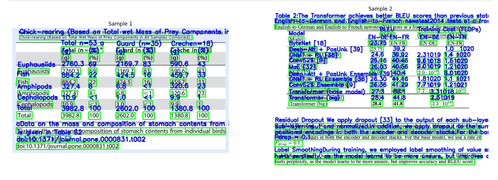
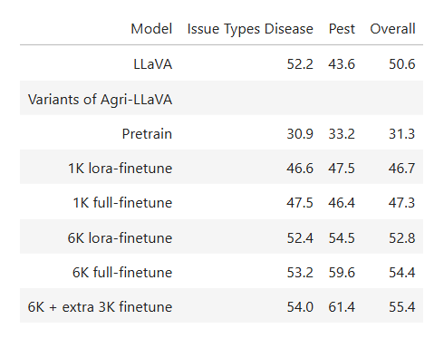

# Multimodal Question Answering – OCR Experiments

This branch contains experiments exploring **OCR-based document understanding** as a component of a **Multimodal Question Answering (QA)** system.

The goal was to evaluate how well different OCR pipelines can extract structured information (text, tables, layouts) from documents and how an **agent-based approach** can verify the correctness of extracted answers.

---

# Overview

This experiment investigates three different OCR pipelines:

| Tool         | Purpose                                                |
| ------------ | ------------------------------------------------------ |
| PaddleOCR    | Detect and extract text from document images           |
| PaddleOCR-VL | Extract structured elements such as tables and layouts |
| Camelot      | Extract tabular data from PDF documents                |

An **agent-based verification step** is used to evaluate the accuracy of extracted answers.

---

# System Pipeline

Document Image / PDF -> OCR Extraction (PaddleOCR / PaddleOCR-VL) -> Structured Data Extraction -> Table Extraction (Camelot) -> Agent-based Answer Verification

The system focuses on **document intelligence and multimodal reasoning**.

---

# 1. PaddleOCR – Text Detection and Visualization

PaddleOCR is used to detect text regions and visualize bounding boxes around detected text.

### Key Steps

* Load the document image
* Run OCR detection
* Draw bounding boxes around detected text
* Overlay recognized text on the image

### Example Implementation

```python
import cv2
import numpy as np
import matplotlib.pyplot as plt

img = cv2.imread(image_path)
img_plot = img.copy()

for text, box in zip(texts, boxes):
    pts = np.array(box, dtype=int)
    cv2.polylines(img_plot, [pts], True, (0,255,0), 2)

    x, y = pts[0]
    cv2.putText(img_plot, text, (x, y-5),
                cv2.FONT_HERSHEY_SIMPLEX, 0.6,
                (255,0,0), 2)
```

### Output

* Bounding boxes around text
* Text labels displayed on the image
* Visualization for debugging OCR quality

## PaddleOCR Detection Result



---

# 2. PaddleOCR-VL – Layout and Table Structure Extraction

PaddleOCR-VL is used to extract **structured layouts** such as tables from document images.

### Key Capabilities

* Document layout detection
* Table structure reconstruction
* HTML representation of tables

### Example Implementation

```python
import cv2
from paddleocr import PPStructure

engine = PPStructure(show_log=False, use_gpu=False, lang='en', layout=True, ocr=True)

img = cv2.imread(image_path)
result = engine(img)

for region in result:
    if region['type'] == 'table':
        html_code = region['res']['html']
```

### Output

* Table structure reconstructed as **HTML**
* Easy rendering inside notebooks
* Structured representation of document tables

## PaddleOCR-VL Detection Result



---

# 3. Camelot – Table Extraction from PDFs

Camelot is used for extracting tables directly from PDF documents.

A filtering method was implemented to separate **real tables from noise**.

### Table Validation Logic

Tables are validated using:

* Minimum rows and columns
* Average cell length
* Numeric content ratio
* Repeated numeric patterns

### Example Filtering Logic

```python
def is_real_table(df, min_rows=3, min_cols=2):

    if df.shape[0] < min_rows or df.shape[1] < min_cols:
        return False

    avg_cell_length = (
        df.astype(str)
        .stack()
        .str.len()
        .mean()
    )

    if avg_cell_length > 40:
        return False

    numeric_mask = df.astype(str).apply(
        lambda col: col.str.contains(r"\d", regex=True)
    )

    numeric_ratio = numeric_mask.sum().sum() / df.size

    if numeric_ratio < 0.15:
        return False

    return True
```

### Example Result

```
Real tables: 10  
Junk tables: 30
```

This filtering step improves downstream **QA reliability** by removing noisy table detections.

---

# Agent-Based Answer Verification

An agent was used to evaluate the **accuracy of extracted information**.

The agent checks:

* Whether extracted text matches expected answers
* Whether table values are correctly parsed
* Whether OCR noise affects answer quality

This helps measure **end-to-end QA accuracy** in document understanding pipelines.

---

# Example Use Cases

* Research paper parsing
* Document QA systems
* Table extraction from scientific PDFs
* Financial document analysis
* Multimodal information retrieval

---

# Tech Stack

Python
OpenCV
PaddleOCR
Camelot
NumPy
Matplotlib

---

# Future Work

* Integrate OCR results with LLM-based QA
* Improve table filtering logic
* Evaluate performance across multiple document types
* Build an automated document QA pipeline

---

# Repository Structure

```
multimodal-question-answering
│
├── paddleocr_experiments.ipynb
├── paddleocr_vl_layout.ipynb
├── camelot_table_filtering.ipynb
├── test_images
└── README.md
```

---

# Key Takeaways

* OCR quality significantly impacts downstream QA accuracy.
* PaddleOCR works well for **text detection**.
* PaddleOCR-VL improves **layout and table extraction**.
* Camelot works best for **PDF table parsing** when combined with filtering.

These experiments explore how **document understanding pipelines can support multimodal QA systems.**

